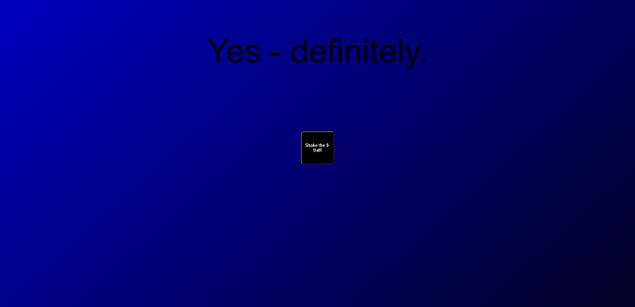

# Magic 8-Ball

[Description](#description)

[Licence](#license)

[Installation](#installation)

[Usage](#usage)

[Dependencies](#dependencies)

[Contributing](#contributing)

[GitHub Link](#github-link)


## Description
Just like back in the 80s, except with JavaScript this time.

### License
GNU General Public Licence

### Installation
N/A

### Usage
Think of a Y/N question, press the button, and recieve your fortune.  

```
var choices = ["It is certain.", "It is decidedly so.", "Without a doubt.", "Yes - definitely.", "You may rely on it.", "As I see it, yes", "Most likely", "Outlook good.", "Yes.", "Signs point to Yes.", "Reply hazy, try again.", "Ask again later.", "Better not tell you now.", "Cannot predict now.", "Concentrate and ask again.", "Don't count on it.", "My reply is no.", "My sources say no.", "Outlook not so good.", "Very doubtful"]
```



### Dependencies
N/A

### Contributing
email me at ryanpburnett@yahoo.com

### GitHub Link
github.com/ryanpburnett

The repo for this readme generator can be found on RPB's [Github](https://github.com/ryanpburnett/readme-generator) page.